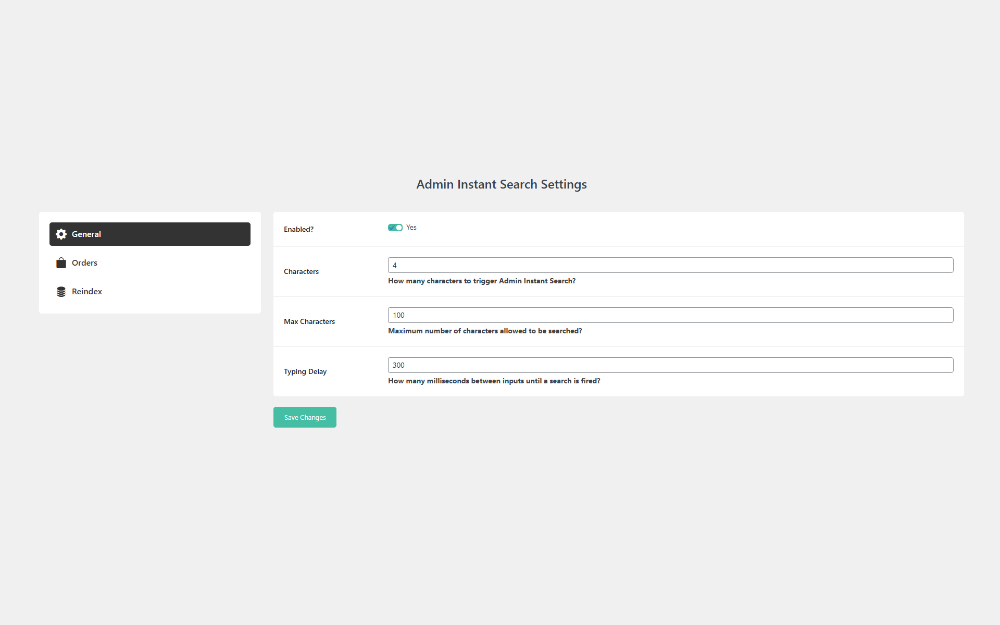
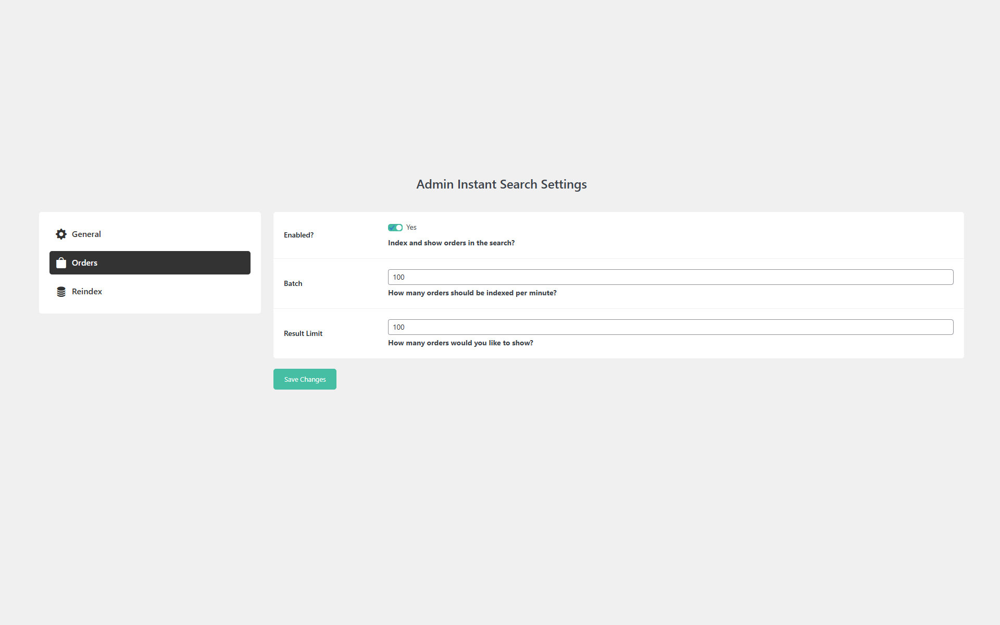

## About

When you frequently search various areas of the WordPress admin, you know the page load times between searches can be frustrating. Admin Instant Search makes finding what you're looking for easier and faster by building an index and keeping it updated as new data comes in.

## Currently Supports

* Instantly Searching WooCommerce Orders

## Features

* Search through all orders instantly without requiring multiple page loads
* Builds an index of all orders and stores them in your database
* Ability to adjust the batch size for the initial index so smaller servers don't get overloaded

## Road Map

* Add support for instantly searching WordPress Posts
* Add support for instantly searching WordPress Pages
* Add support for instantly searching WordPress Users
* Add support for instantly searching WooCommerce Customers
* Add support for instantly searching Settings

## GDPR

We are not lawyers and always recommend doing your own compliance research into third-party plugins, libraries, etc., as we've seen other plugins not be in compliance with these regulations.

This plugin uses the Bootstrap, BootStrap Icons, and SweetAlert2 third-party libraries. These libraries are loaded locally to be compliant with data protection regulations. This plugin also uses TNTSearch.

This plugin collects and stores certain data on your server to ensure proper functionality. This includes:

* Storing plugin settings
* Remembering which notices have been dismissed

## Screenshots

## Installation

1. Backup WordPress
2. Upload the plugin files to the `/wp-content/plugins/` directory, or install the plugin through the WordPress plugins screen directly.
3. Activate the plugin through the 'Plugins' screen in WordPress
4. Configure the plugin

## Frequently Asked Questions

### Why should I use this?

If you find yourself auditing orders, looking up orders for customer inquiries, or just overall searching orders frequently, this will save you from multiple page loads between search queries.

### How long will it take to index?

By default it will index 100 orders per minute.

## Changelog

### 1.1.0
* Updated: Indexing to use TNTSearch
* Updated: Logic for search to handle updating results already shown on the search page
* Added: Translation

### 1.0.0
* Initial Release